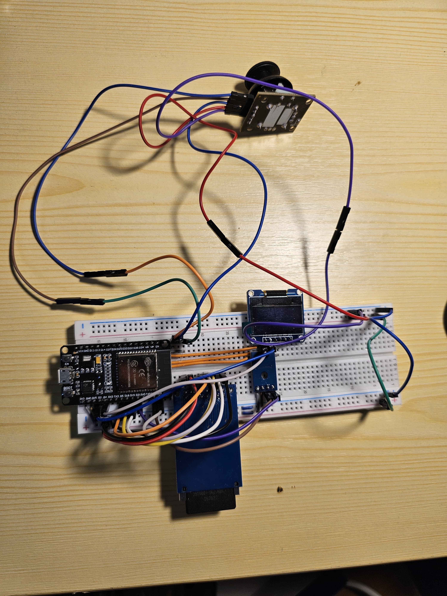
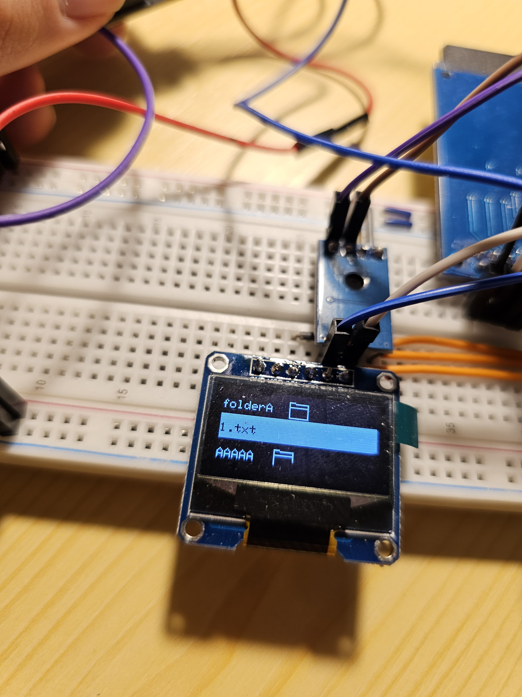
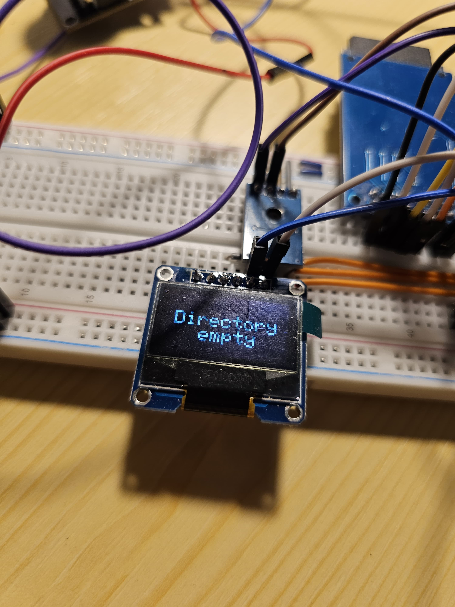

# ESP32 Cloud

SD card storage accessed wireless in LAN via HTTP server running on ESP32.

## Components

<ul>
    <li>ESP32 board :globe_with_meridians:</li>
    <li>SD card reader SPI</li>
    <li>SSD 1306 SPI OLED display :tv:</li>
	<li>AT24C256 EEPROM memory module</li>
    <li>Joystick :joystick:</li>
    <li>Jumper Wires</li>
</ul>



## Usage
The user can navigate through folders and files of the SD card by using the joystick.

### Controls :joystick:

<ul>
    <li>Left: go back one directory</li>
    <li>Right / Press: if the selected is a directory navigate to it</li>
    <li>Up: scroll up</li>
	<li>Down: scroll down</li>
</ul>

 


 
 

If a folder is empty, an appropiate message is displayed.
 


 
 

Since the project is meant to be a cloud, the files can also be accessed from a browser via the running HTTP Server.
 
When entering the root page of the server, together with a welcome message, the file structure of the root folder is presented. Folders have a folder emoji next to them and their name is a link, which when it is clicked redirects the player to a page containg that folder's file strucure.

