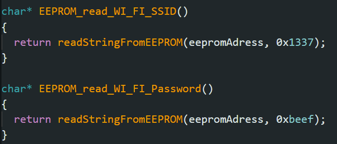
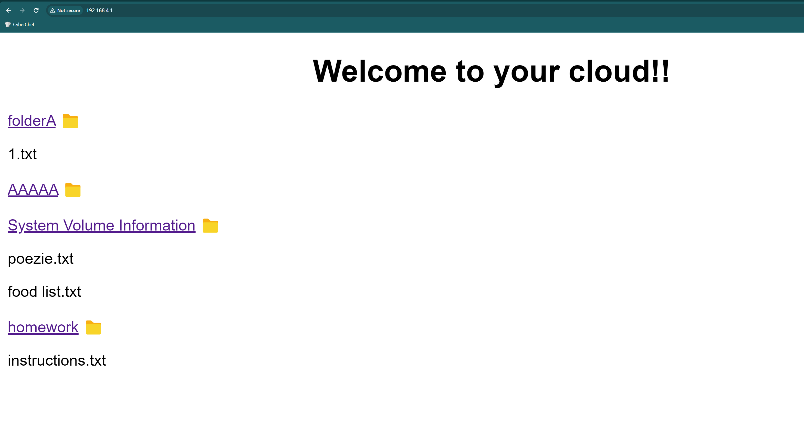
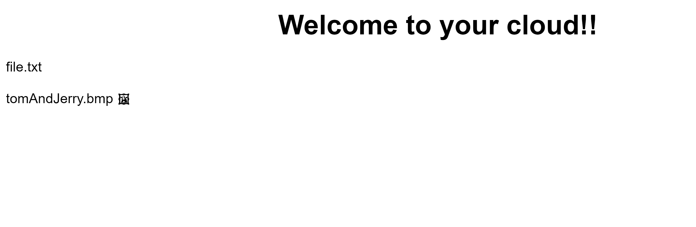
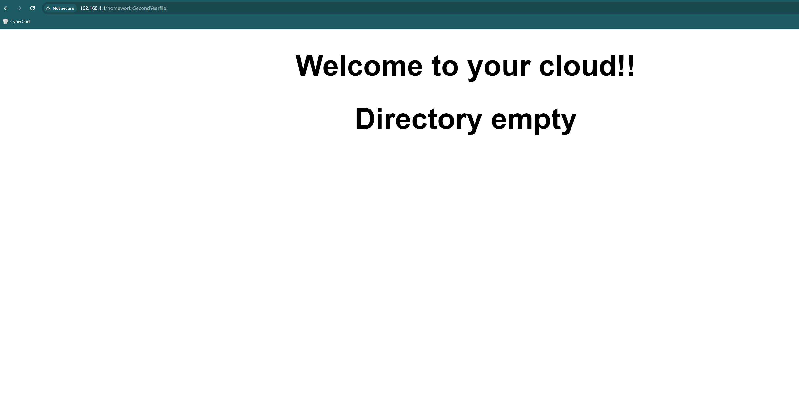

# ESP32 Cloud

SD card storage accessed wireless in LAN via HTTP server running on ESP32 and locally via a joystick and an OLED display.

## Components

<ul>
    <li>ESP32 board :globe_with_meridians:</li>
    <li>SD card reader SPI</li>
    <li>SSD 1306 SPI OLED display :tv:</li>
	<li>AT24C256 I^2^C EEPROM memory module</li>
    <li>Joystick :joystick:</li>
    <li>Jumper Wires</li>
</ul>



## Usage
The user can navigate through folders and files of the SD card by using the joystick.

### Configuration stored in external EEPROM module
The Access Point's credentials are stored in the AT24C256 256Kb memory.
 
They are stored at adresses **0x1337** and **0xbeef**.




### Controls :joystick:

<ul>
    <li>Left: go back one directory</li>
    <li>Right / Press: if the selected is a directory navigate to it</li>
    <li>Up: scroll up</li>
	<li>Down: scroll down</li>
</ul>

 


 
 

If a folder is empty, an appropiate message is displayed.
 


 
 

Since the project is meant to be a cloud, the files can also be accessed from a browser via the running HTTP Server.
 
When entering the root page of the server, together with a welcome message, the file structure of the root folder is presented. Folders have a folder emoji next to them and their name is a link, which when it is clicked redirects the player to a page containg that folder's file strucure. When we want to navigate back to a folder we simply press the back button of the browser.
 

 
 

Images also have a specific emoji next to them.

 
 

If a folder is empty, a specific message is displayed on the webpage.

